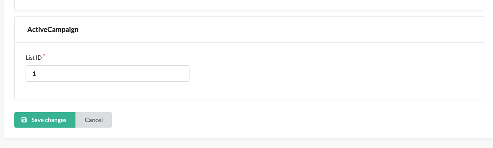

# Usage

> This plugin makes use of the two components of _Symfony_ [Messenger][symfony_messenger]
> and [Serializer][symfony_serializer].
> It is highly recommended to have a minimum knowledge of these two components to understand how this integration works.

This plugin is, basically, a simple resource exporter from _Sylius_ to _ActiveCampaign_. The behavior of the plugin for
each resource can be summarized as follows:

- A property containing the resource id of ActiveCampaign is added to the corresponding resource on Sylius.
- Each resource has a corresponding enqueuer. The enqueuer takes care of queuing a message on the Symfony Messenger bus.
  To decide which event to queue, the enqueuer first looks to see if the ActiveCampaign id persisted on the Sylius
  resource is present, if this is the case an update event is queued. Either, it searches for an ActiveCampaign resource
  that is already present through the use of some unique properties. If a resource is founded, the ActiveCampaign ID of
  that resource is persisted on the Sylius resource property and an update event is queued. Finally, if none of the
  above has occurred, a resource creation on ActiveCampaign event is queued.
- After the first installation and/or after each resource creation/modification/removal event on Sylius, the enqueuer is
  called so a proper Message is dispatched to the Symfony Messenger.
- For each ActiveCampaign resource message there is a Create, Edit, and Remove Handler. These handlers are responsible
  for mapping the Sylius resource to an ActiveCampaign resource, sending it to the ActiveCampaign WS, and then reading
  the response. Of course, each of the handlers is slightly different from this standard, for example: currently, only
  the creation returns the response from the WS to persist the id on the Sylius resource, or the remove handler does not
  map the Sylius resource as it has none need. Communication with the WS of ActiveCampaign takes place thanks to the
  Symfony Serializer component.

The 4 managed ActiveCampaign resources are the following:

- Contact
- Connection
- Ecommerce Customer
- Ecommerce Order/Abandoned Cart

### Contact

The ActiveCampaign's Contact is the equivalent for the Sylius Customer. It is the more "customizable" resource thanks to
the FieldValues properties. You don't need to decorate all the ContactMapper to add a custom field collected in your
store forms. You could simply listen for
the `webgriffe.sylius_active_campaign_plugin.mapper.customer.pre_add_field_values` event. This event will dispatch
a `Symfony\Component\EventDispatcher\GenericEvent` containing the Customer as subject and an array of `fieldValues` as
argument. Populate this argument with your custom field values. Remember that every item of this array should be an
instance of the `Webgriffe\SyliusActiveCampaignPlugin\Model\ActiveCampaign\FieldValueInterface`.

Before creating the resource on ActiveCampaign, the ContactEnqueuer queries for a corresponding contact with the
same `email`.

#### Contact tags

To complete your contact you will probably have to add some tags to this contact. If this is your case there is
nothing to more simple than add this tags to your contact 😀. After the creation or the update of a Sylius customer a
new
Message `ContactTagsAdder` will be dispatched to the messenger bus. The `ContactTagsAdderHandler` will use
the `webgriffe.sylius_active_campaign_plugin.resolver.contact_tags`
service to resolve a list of tags to add to the contact. By default, this service will return an empty list, but you can
customize it by overriding this service and by making it implements
the `Webgriffe\SyliusActiveCampaignPlugin\Resolver\ContactTagsResolverInterface`. The more beautiful thing is that you
don't have to worry about retrieve the ActiveCampaign tag's id, the plugin will do it for you 🎉. You just have to
return an array of tags as string. The value of each item is the tag that will be added to the contact; then the plugin
will check if the tag exists or not, if not it will create it. Then it will try to add to the contact.

> **NB** The plugin does not "update" the tags of the contact, it will simply add the tags returned from
> the `ContactTagsResolverInterface`.

#### Contact list subscription

It is probably that, with your customer, you are using also one or more contact lists, and that you want to synchronize
the contact's status subscription to that list by your Sylius store. Well, that's also our case 😎!
Unfortunately, every use of the lists on your ActiveCampaign could be different from others, so can not be one solution
for everyone, but with this in mind, we thought about a solution that could be easily customized and that will be as
simple as we could, just like Sylius self is 😀.

So, we have thought that a usual starting point could be having a contact list for every channel and that this list
could be different by each channel you have, or that you could also not have at all a list for a given channel. To do
so, we have added a property to your Channel entity, the ActiveCampaign list id. This field can be customized by your
admin channel page and should contain the id of the list for that channel, or you can leave it empty for not add the
contact to a list.



With the create/update of a Sylius customer a new `ContactListsSubscriber` message is dispatched.
The `ContactListsSubscriberHandler` will then use the `CustomerChannelsResolver` to determine the channels for which a
contact list subscription should be created or updated. Then each channel will check if a list id is provided, if not it
will skip that channel. Then the `ListSubscriptionStatusResolverInterface` service is called. This service is
responsible
for retrieving, given a customer and a channel, the ActiveCampaign's list subscription status. If this fails the
procedure will continue with the next channel, otherwise it will create or update the contact list subscription with the
resolved status. As you will have understood, the core of this procedure is the implementation of
the `ListSubscriptionStatusResolverInterface`,
for this reason we have prepared two implementations of this interface. The default one, installed by default with the
plugin there is the `ChannelCustomerBasedListSubscriptionStatusResolver`,
but you can use also the `CustomerBasedListSubscriptionStatusResolver`. Remember that
the `ContactListsSubscriberHandler` will "try" to resolve the list subscription status, so if
something is wrong, or you don't want that, in certain conditions, the list subscription status will be changed or
created, then you can throw any exception that implements the
`Webgriffe\SyliusActiveCampaignPlugin\Exception\ListSubscriptionStatusResolverExceptionInterface` interface. This
exception will be caught by the handler and the list subscription will not be created or updated.

- `ChannelCustomerBasedListSubscriptionStatusResolver`. This
  service (`webgriffe.sylius_active_campaign_plugin.resolver.channel_customer_based_list_subscription_status`) uses the
  ChannelCustomer association created for the Ecommerce Customer (you will have a look at this association in a few in
  the Ecommerce Customer's chapter, for the moment just take the concept of this relationship between a Customer and a
  Channel). This service will then use the `listSubscriptionStatus` property on the ChannelCustomer entity. By default,
  if this field is null it will avoid creating or updating that association, otherwise, it will use the int of that
  field that should be one of the defined in
  the `Webgriffe\SyliusActiveCampaignPlugin\Resolver\ListSubscriptionStatusResolverInterface`. Obviously, you can
  customize this and for example, create a list subscription for the contact with the unconfirmed status if the field is
  empty, and you want that all contacts are associated with the given list.
- `CustomerBasedListSubscriptionStatusResolver`. This
  service (`webgriffe.sylius_active_campaign_plugin.resolver.customer_based_list_subscription_status`) uses the
  Customer's property `isSubscribedToNewsletter`. Obviously, this field is applied to the customer by Sylius, so his
  value is used for all the channel's lists. If it is true the contact will be subscribed to all the lists and
  vice-versa. This service could be exactly what you need if you only have a channel or a list, but it's the less
  customizable and for this reason, it is not the default method used by the handler. To use this service you just have
  to override the `webgriffe.sylius_active_campaign_plugin.message_handler.contact.lists_subscriber` service
  definition's arguments by replacing
  the `webgriffe.sylius_active_campaign_plugin.resolver.channel_customer_based_list_subscription_status`
  with `webgriffe.sylius_active_campaign_plugin.resolver.customer_based_list_subscription_status`.

#### Update the contact list subscription

If you have enabled the contact list subscription feature it could be probably that you need also to have a return from
ActiveCampaign if this state change on this system. Let's make an example: The customer have subscribed to the
newsletter, so it has been subscribed to a contact's list. But, after a while, the customer chooses to unsubscribe from
this list thanks to the email link. When the customer make some update to his data or when a new contact update is
dispatched, the contact will be subscribed again in the list if the subscription status is not touched. This will cause
a
problem for you contact and your business image. In order to prevent this we have thought to use the ActiveCampaign's
webhook
functionality to receive the new list status subscription.
First, if you have skipped the `app_routes` step in the installation you should add this route to your application.
Then, you should add the webhook on ActiveCampaign. Of course, you could add the webhook manually from the app
dashboard, but we have prepared a command to add it directly from your Sylius store, check
the [First setup docs](03_A-First_setup.md) on how to launch this command.

When the webhook comes from ActiveCampaign a new ContactListsUpdater message is dispatched to the bus.
Then the ContactListsUpdaterHandler will catch this message and make an HTTP get request to retrieve the updated contact
from ActiveCampaign. Now, as for the subscriber, there are two possibilities to update the status of the list
subscription that both implement the
`Webgriffe\SyliusActiveCampaignPlugin\Updater\ListSubscriptionStatusUpdaterInterface`.

- `ChannelCustomerBasedListSubscriptionStatusUpdater`. This
  service (`webgriffe.sylius_active_campaign_plugin.updater.channel_customer_based_list_subscription_status`) is the
  default used by the handler. It will try to retrieve the Channel Customer association and update the status of the
  subscription on that entity.
- `CustomerBasedListSubscriptionStatusUpdater`. This
  service (`webgriffe.sylius_active_campaign_plugin.updater.customer_based_list_subscription_status`) uses the
  isSubscribedToNewsletter Customer's property, so it will update this entity. To use this service you just have
  to override the `webgriffe.sylius_active_campaign_plugin.message_handler.contact.lists_updater` service
  definition's arguments by replacing
  the `webgriffe.sylius_active_campaign_plugin.updater.channel_customer_based_list_subscription_status`
  with `webgriffe.sylius_active_campaign_plugin.updater.customer_based_list_subscription_status`.

**NOTE!** If you use the customer's isSubscribedToNewsletter property, and you have more than one list you probably have
to customize the StatusUpdater service to update the status only if the status comes from a certain list or by others
logic.

### Connection

The ActiveCampaign's Connection is the equivalent of the Sylius Channel. We have opted for this way instead of making
only one connection to allow more flexible use on ActiveCampaign's integrations.

Before creating the resource on ActiveCampaign, the ConnectionEnqueuer queries for a corresponding connection with the
same `service` (static to `sylius`) and `externalid` (the channel's code).

### Ecommerce Customer

There is no ActiveCampaign's Ecommerce Customer equivalent on Sylius Standard. So, the plugin offers a simple way to add
a new Sylius resource `ChannelCustomer` which is a simple Channel-Customer association. The ActiveCampaign Ecommerce
Customer's id is persisted on this entity. By default, the Ecommerce Customer is created by a Customer and associated
with all the Channels. But, especially if you use Sylius Plus, you may not want to do this. In this case, you just need
to decorate the `Webgriffe\SyliusActiveCampaignPlugin\Resolver\CustomerChannelsResolverInterface` service and implement
it with your custom logic.

Before creating the resource on ActiveCampaign, the EcommerceCustomerEnqueuer queries for a corresponding ecommerce
customer with the same `email` and `connectionid` (the channel's code).

### Ecommerce Order/Abandoned Cart

The ActiveCampaign's Ecommerce Order is the equivalent of the Sylius Order. In addition, as done on Sylius, The
Abandoned Cart is the same entity as the Ecommerce Order, so also the Abandoned Cart is related to the Sylius Order.

But what if you need to export to ActiveCampaign only some Sylius Orders? Simply, just override the logic inside the
`findAllToEnqueue` `OrderRepository`'s method. So, you can, for example, exports only orders by some customers.

The EcommerceOrderProductMapper service set the product image url needed to show it in the ActiveCampaign admin
dashboard but also for the email template. By default, the service will take the first image for the product, but you can
specify a Sylius image type to use for this purpose (for example you could have a `main` type used to specify the first
image of the product). You could also set the Liip imagine filter to apply to the image to be loaded more easily. Set 
these parameters in the `webgriffe_sylius_active_campaign_plugin.yaml` file:

```yaml
webgriffe_sylius_active_campaign:
    ...
    mapper:
        ecommerce_order_product:
            image_type: 'main'
            image_filter: 'sylius_medium'
```

Before creating the resource on ActiveCampaign, the EcommerceOrderEnqueuer queries for a corresponding ecommerce order
with the same `email` and `externalid` (the order's id)/`externalcheckoutid` (the cart's id) based on the state of the
order (cart or different).

### Customer tracking

As stated in
the [ActiveCampaign documentation](https://help.activecampaign.com/hc/en-us/articles/221542267-An-overview-of-Site-Tracking)
, the tool provide an easy way to add website contact tracking to finalize your marketing automations. To add this
feature on your store, you should simply add the account id as an environment variable to you app:

```dotenv
WEBGRIFFE_SYLIUS_ACTIVE_CAMPAIGN_ACCOUNT_ID=account-id-sample
```

Automatically the script will be added to all the website pages. Take note that to works the script needs the email of
the contact which is using the website, to retrieve this email the plugin use the CustomerContext Sylius's service. This
one provide always the email if the user is logged in, otherwise it will provide the email only after a guest login for
example.

### Start with Sylius ActiveCampaign plugin

Here are some points/actions to do or to take inspiration from to start using the plugin:

[symfony_messenger]: https://symfony.com/doc/current/messenger.html

[symfony_serializer]: https://symfony.com/doc/current/serializer.html
